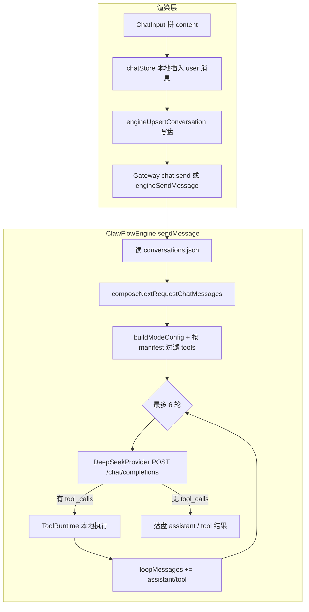

# 每次对话发往模型的内容与文件（以 DeepSeek 为例）

> **事实来源**：`src/engine/next-request-context.ts`、`src/engine/clawflow-engine.ts`、`src/engine/providers/deepseek.ts`、`src/engine/tool-runtime.ts`、`src/store/modules/chatStore.ts`、`src/components/chat/ChatInput.tsx`  
> **路径约定**：工作区根为 `${WORKSPACE_ROOT}`；ClawFlow 元数据目录为 `${WORKSPACE_ROOT}/.agent/.clawflow/`（代码中 `clawflowDir()`）。

---

## 1. 一句话结论

每次用户发送消息时，**DeepSeek 收到的是 JSON**：`messages`（文本对话数组）+ 可选 `tools`（函数 JSON Schema）+ `thinking` / `reasoning_effort` 等。

- **不会**上传拖入文件的二进制、工作区目录树、`manifest.json`、`.agent/.memory/`、Hermes 索引库等。
- 拖入附件只会变成用户消息里的 **反引号绝对路径**。
- 文件正文只有模型在 **Plan / Multitask** 下调用 `workspace_read_file*` 等工具后，以 **tool 消息的文本** 进入后续轮次。

---

## 2. 端到端流程



| 阶段 | 关键代码 |
|------|----------|
| 输入拼装 | `src/components/chat/ChatInput.tsx` → `submit()` |
| 发送入口 | `src/store/modules/chatStore.ts` → `sendMessage()` |
| Gateway | `src/engine/gateway-daemon.ts` → `chat:send` → `sendMessage()` |
| 消息组装 | `src/engine/next-request-context.ts` → `composeNextRequestChatMessages()` |
| 提供方 | `src/engine/providers/deepseek.ts` → `agentStreamChatCompletion()` |
| 工具循环 | `src/engine/clawflow-engine.ts` → `sendMessage()` 内 for 循环 |
| 会话落盘 | `${WORKSPACE_ROOT}/.agent/.clawflow/conversations.json` |

默认模型 ID：`deepseek/deepseek-chat`（API 侧为 `deepseek-chat`）。密钥来自设置页 `auth-store` 或环境变量 `DEEPSEEK_API_KEY`。

---

## 3. HTTP 请求体结构

### 3.1 `messages` 数组

由 `composeNextRequestChatMessages()` 生成，结构：

```text
[ { role: "system", content: "..." }, ...历史..., （可选）{ role: "user", content: "本轮 userText" } ]
```

| 序号 | role | 内容来源 | 是否读取磁盘文件 |
|------|------|----------|------------------|
| 1 | **system** | `${WORKSPACE_ROOT}/.agent/.roleAgent/` 下全部 `.md` | ✅ 每次请求现场读取；单文件约 24k 字符，合计约 100k 字符上限（`role-agent-context.ts`） |
| 2…n | **user / assistant** | `conversations.json` 中该会话的 `messages` | ❌ 上传的是 JSON 内已存的文本，不是整文件 |
| 可选 | **assistant** + `tool_calls` | 引擎工具轮次落盘 | 字段随 `messages` 序列化 |
| 可选 | **tool** | 工具执行返回字符串 | 工具在本地读盘，结果写入 `content` |
| 末条 | **user** | 本轮 `userText` | 若历史中最后一条 user 已与 `userText` 相同则不再追加 |

**默认注入的 role 文件顺序**（`WORKSPACE_ROLE_AGENT_FILES_ORDER`）：`AGENTS.md` → `SOUL.md` → `TOOLS.md`，其余 `.md` 按文件名排序追加。

**本轮 user 文本示例**（含附件）：

```text
请总结这份文档

`E:\workspace\.agent\.clawflow\chat-drop-cache\report.pdf`
```

附件来源：拖入时复制到 `chat-drop-cache`（`workspace:copyChatDropFiles`），发送时只带路径。

### 3.2 `messages` 以外的字段

| 字段 | 条件 | 说明 |
|------|------|------|
| `model` | 总有 | `apiModelFromClawId()` 去掉 `deepseek/` 前缀 |
| `stream: true` | 总有 | 主路径 `agentStreamChatCompletion` |
| `tools` + `tool_choice: "auto"` | Plan / Multitask 且开启工具 | `createDefaultToolRuntime().listSchemas()`，再经 manifest 过滤 |
| `thinking` / `reasoning_effort` | 由 mode + intent 决定 | 见 `src/engine/mode-policy.ts` |
| `response_format` | `jsonMode` 时 | `{ type: "json_object" }` |

发往 DeepSeek 前会对 `tools` 做 **sanitize**（去 `strict`、补全 object 的 `required`），见 `sanitizeToolsForDeepSeekRequest()`。

**`tools` 是函数 Schema 列表**，不是把 `.agent/.tool/docs.md` 等契约文件内容塞进 body；契约主要靠 system 里的 `TOOLS.md`/`AGENTS.md` 文字说明。

---

## 4. 工作区 manifest 与工具可见性

开关文件：`${WORKSPACE_ROOT}/.agent/.tool/manifest.json`（`version: 2`）。

映射逻辑：`src/shared/workspace-tool-manifest-bridge.ts` → `filterToolSchemasByWorkspaceManifest()`。

| manifest 键 | 典型工具名（节选） |
|-------------|-------------------|
| `tools.docs` | `workspace_list_dir`, `workspace_read_file`, `workspace_write_file`, `workspace_apply_patch`, … |
| `tools.web_search` | `web_search` |
| `tools.web_scrape` | `web_scrape` |
| `tools.embedded_browser` | `open_embedded_browser` |
| `tools.git` | `workspace_git_status`, `workspace_git_diff`, `workspace_git_log` |
| `tools.todos` | `workspace_todo_*` |
| `tools.subagents` | `workspace_subagent_*`, `delegate_to_subagent` |
| `tools.skills` | `workspace_skill_*` |
| `tools.knowledge_base` | `workspace_knowledge_query`, `workspace_memory_search`, … |

始终允许（不受 manifest 关断）：`get_date`。

**Plan / Multitask** 默认 `toolsEnabled: true`（`buildModeConfig`）；**Ask** 在 Gateway 中常被映射为 `plan`。

---

## 5. 磁盘上存在、但不会自动进入 API 的内容

| 路径 | 用途 | 与单次对话 API 的关系 |
|------|------|------------------------|
| `.agent/.clawflow/conversations.json` | 会话历史 | 仅抽出 message 字段进 `messages` |
| `.agent/.clawflow/chat-drop-cache/*` | 拖入附件副本 | 仅路径出现在 user 文本 |
| `.agent/.memory/`、根目录 `MEMORY.md` | 主 Agent 记忆约定 | **不自动注入**；需模型写盘或工具读取 |
| `.agent/.tool/manifest.json` 及 `*.md` | 能力开关与契约 | manifest **不**进 body；roleAgent 下 `TOOLS.md` **会**进 system |
| `.agent/.skills/**`、Hermes FTS DB | 技能与检索索引 | 仅工具调用后片段进入 tool 消息 |
| `.agent/.clawflow/sub-agents.v1.json` | 子 Agent 名册元数据 | 不进主会话；委派时子 Agent **另起** `sendMessage` |
| `.subagent/.subroleAgent/`、`.subclawflow/`、`.submemory/` | 子 Agent 模板与缓存 | 主会话不发送 |
| 工作区普通项目文件 | 源码与资料 | 不发送；靠 read/rg/git 等工具按需读入 |

---

## 6. 历史消息收录规则

实现：`buildTailChatMessagesFromStored()`（`next-request-context.ts`）。

| role | 是否纳入 | 条件 |
|------|----------|------|
| user | ✅ | 全部 |
| assistant | ✅ | 全部；保留 `reasoning_content`、`tool_calls` |
| tool | 条件纳入 | 必须有 `tool_call_id`；且 `meta.status` 为 `result` / `error`，或无 status |
| tool（中间态） | ❌ | 如仅 `running`、`[tool:start]` 的 UI 卡片 |

**上下文长度**：发送前**无**自动裁剪或滑动窗口；整段历史参与 `JSON.stringify(messages)`。UI「下一请求上下文」_meter 仅估算（`estimateNextRequestContext`），不阻止发送。

落盘去重：`dedupeStoredToolMessages()`（`session-store` 合并会话时、同 `tool_call_id` 保留最优一条）。

---

## 7. 同一次发送内的多轮工具循环

`ClawFlowEngine.sendMessage()` 内最多 **6** 步：

1. 用当前 `loopMessages` 请求 DeepSeek。  
2. 无 `tool_calls` → 结束，持久化最终 assistant。  
3. 有 `tool_calls` → `ToolRuntime.executeToolCalls()`（低风险可自动执行，中/高风险可 `chat:toolApproval`）。  
4. 将 assistant（含 `tool_calls`、`reasoning_content`）与 tool 结果追加到 `loopMessages` 并写盘。  
5. 重复直到无工具调用或达上限。

同一次用户发送可能对应 **多次** `POST /chat/completions`。工具返回的文本可能被截断（如 `truncateForToolLog`、读文件行数/字节上限），见 `tool-runtime.ts`。

DeepSeek R1 / reasoner：`reasoning_content` 必须在后续轮次原样带回（`clawflow-engine.ts` 注释与 assistant 消息结构）。

---

## 8. 持久化与发送时序

### 8.1 正常路径

1. 渲染层 `chatStore.sendMessage` 将 user 消息写入内存。  
2. `engineUpsertConversation(conversationForEngineUpsert(conv))` 写入 `conversations.json`。  
3. Gateway `chat:send` 或 `engineSendMessage` 调用 `sendMessage({ userText: content, ... })`。  
4. 引擎 `buildHistoryMessages` = 读盘 + `pendingUserText` 去重追加。  
5. 工具轮次与最终回复由引擎 `appendMessages` / `appendAssistantMessage` 写盘。

飞书桥接等路径会调用 `appendPersistedUserMessage`；**桌面聊天主路径不在引擎内单独 append user**。

### 8.2 渲染层 upsert 的字段缺口（实现边界）

`conversationForEngineUpsert()` 仅同步：

- `id`, `role`, `content`, `timestamp`, `channel`
- assistant 的 `reasoning_content`

**未同步**：`tool_call_id`、`tool_calls`、tool 的 `meta` 等。

因此：发送前 upsert **可能覆盖**引擎在工具轮次写入的完整历史。若磁盘上仍保留引擎写入的 `tool_calls`，组 API 时仍会发给模型；若被 upsert 抹掉，多轮工具上下文可能断裂。排查工具会话问题时应对比 **磁盘 JSON** 与 **UI 列表**。

---

## 9. 发送后不进入本条 HTTP body 的行为

| 行为 | 说明 |
|------|------|
| `workspaceAppendChangeLog` | 工作区变更摘要，非模型输入 |
| Skill Agent 进化 | `maybeScheduleSkillEvolutionAfterMainTurn`，独立调度 |
| `delegate_to_subagent` | 子 Agent `runSubAgentOnce`，结果以 tool 文本回主会话 |
| 流式 `chat:delta` / 思考 demux | 仅 UI 展示 |

---

## 10. 对照表：常见路径是否进入 DeepSeek API

| 项目 | 进入 API？ | 形式 |
|------|------------|------|
| `.agent/.roleAgent/*.md` | ✅ | `messages[0].content`（system） |
| 用户输入 + 附件路径 | ✅ | user `content` 文本 |
| `conversations.json` 历史 | ✅ | 多条 user/assistant/tool |
| `chat-drop-cache` 文件内容 | ❌ | 仅路径字符串 |
| `.agent/.memory/`、`MEMORY.md` | ❌* | *除非写入 roleAgent 的 md 或工具读过 |
| `.agent/.tool/manifest.json` | ❌ | 仅影响 `tools` 数组是否包含某函数 |
| `.agent/.skills`、Hermes DB | ❌* | *经 `workspace_memory_search` 等后片段进 tool |
| `sub-agents.v1.json` | ❌ | 主会话；子 Agent 另跑 |
| 工具 JSON Schema | ✅ | 请求体 `tools` |
| 工具读到的文件 | ✅* | *tool `content`（可能截断） |

---

## 11. 相关 IPC / 类型（速查）

| 名称 | 用途 |
|------|------|
| `workspace:copyChatDropFiles` | 拖入复制到 `chat-drop-cache` |
| `engine:sendMessage` / Gateway `chat:send` | 发起对话 |
| `engine:upsertConversation` | 渲染层同步会话到主进程 |
| `engine:estimateNextRequestContext` | 下一请求体积估算（与真实 payload 同组装逻辑） |
| `ChatMessage` | `src/engine/providers/types.ts` |
| `SubAgentSlot` | `src/shared/sub-agent-types.ts`（名册在 `sub-agents.v1.json`，不进主会话 API） |

---

## 12. 若需产品行为变更（非现状）

| 目标 | 需改动方向（示意） |
|------|-------------------|
| 拖入即发送文件正文 | 发送前读文件并拼入 `userText`，或接 vision/文档 API |
| 自动注入 `.agent/.memory` | 在 `composeNextRequestChatMessages` 增加 memory 段 |
| 发送前裁剪超长历史 | 在 `buildTailChatMessagesFromStored` 或引擎侧加 window 策略 |
| upsert 保留 tool 元数据 | 扩展 `conversationForEngineUpsert` 字段映射 |

---

*文档版本：与仓库 `src/engine/*`、`src/store/modules/chatStore.ts` 实现对齐；若代码变更请以代码为准并更新本文「事实来源」一节。*
