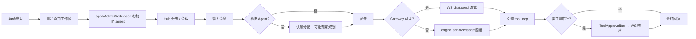

# ClawFlow 产品原型（以当前代码反推）

> **单一事实来源**：`src/App.tsx`、`src/components/Layout.tsx`、`src/pages/*`、`src/components/WorkspaceSidebar.tsx`。  
> 本文描述用户可见的信息架构与交互壳层，不绑定具体视觉稿。  
> **改进方向**见文末 [附录 A：原型改进建议](#附录-a原型改进建议)。

## 1. 产品定位

ClawFlow 是一款 **以本地文件夹为工作区（Workspace）边界** 的 Electron 桌面 AI 协作应用。用户将项目目录挂载为工作区后，在同一壳层内完成：

- 多会话对话（Gateway WebSocket 流式、工具调用、审批）
- 工作区文件 / Git / Shell 等受控工具能力
- 周期调度定时触发、网页抓取、Hermes 技能与记忆检索
- 可选飞书入站桥接、本地 Gateway、系统子 Agent 辅助分类与规划

应用 **启动时不自动绑定工作区**；用户从侧栏添加或选择文件夹后，经 `workspace:setActive` / `applyActiveWorkspace` 激活（见 `workspace-service.ts`、`WorkspaceSidebar`）。

## 2. 顶层导航

| 路由 | 页面 | 说明 |
|------|------|------|
| `/chat` | 聊天 + 工作区 Hub | 默认首页（`/` 重定向至此） |
| `/skills` | Hermes 技能浏览器 | 全页技能树/编辑（`SkillsPage` → `HermesSkillsBrowser`） |
| `/settings` | 设置中心 | 8 分区侧栏导航（见 §7） |
| `/dashboard` | — | 重定向到 `/settings`（历史入口） |

壳层全局：`Titlebar`（Windows 自定义标题栏）、`ToastHost`、`ErrorBoundary`；标准壳用 `BottomShellFabs`，便签壳用 `StickyDesktopDock`。

## 3. 两种桌面壳层（Shell）

由 `useShellViewStore`（`clawflow.shellViewMode`）与 `ShellLayoutContext` 控制。

### 3.1 标准三栏壳（`standard`）

```
┌─────────────────────────────────────────────────────────────┐
│ Titlebar（菜单：聊天 / 技能 / 设置；窗口控制）                  │
├──────────┬──────────────────────────────┬───────────────────┤
│ Workspace│  主内容区（Outlet）           │ ChatRightTabs     │
│ Sidebar  │  - /chat → ChatPage          │ - 工作区文件树     │
│          │  - /skills → SkillsPage      │ - 变更日志         │
│ 工作区列表│  - /settings → SettingsPage  │ - 抓取记录         │
│ Hub 分支 │                              │                   │
│ 会话预览 │                              │                   │
└──────────┴──────────────────────────────┴───────────────────┘
         ↑ 可拖拽分栏宽度（localStorage 持久化）
```

- **右栏仅三 Tab**（`ChatRightTabs.tsx`：`workspace` | `changes` | `scrape`）。
- **窄屏**（视口 &lt; 980px 且非便签模式）：`cf-mobileBar` 顶栏；**不渲染** `ChatRightTabs`（文件树/变更/抓取在此布局下不可用，需桌面宽屏或 Hub 内入口）。
- 证据：`src/components/Layout.tsx`、`src/components/chat/ChatRightTabs.tsx`。

### 3.2 便签玻璃壳（`alternate`，仅 `/chat` 桌面宽屏）

- 整页替换为 `StickyNoteShell`：紧凑窗口、`cf-stickyGlassRoot`、`window:setShellViewAppearance({ compact: true })`。
- 中心 Tab：**聊天 / 周期调度 / 知识库**（`StickyNoteShell`：`chat` | `todos` | `kb`）；`kb` 嵌入 `KnowledgeBaseHubPanel`（与标准壳 Hub 一致）。**无 skills Tab**——技能需 Titlebar 进入 `/skills` 或切回标准壳 Hub `skills`。
- **卫星窗**：拖出独立 `BrowserWindow`；`sticky:openSatellite` / `sticky:mergeSatellite` + `sticky:detachedPaths` 同步路径。
- 底部：`StickyDesktopDock`（视图切换、进化测试等 FAB）。
- 证据：`Layout.tsx`、`StickyNoteShell.tsx`。

### 3.3 标准壳 vs 便签壳（能力对照）

| 能力 | 标准壳 `standard` | 便签壳 `alternate` |
|------|-------------------|---------------------|
| 工作区侧栏 + Hub 四分支 | 有 | 左侧工作区标签条（无完整 Hub 树） |
| 聊天右栏（文件/变更/抓取） | 桌面宽屏有 | 无（`StickyFileStrip` 等替代） |
| 全页 `/skills` | Titlebar | Titlebar |
| Hub `skills` 轻量面板 | 有（`SkillsHubPanel`） | 无（需路由 `/skills`） |
| FAB | `BottomShellFabs` | `StickyDesktopDock` |

## 4. 工作区侧栏（Workspace Hub）

每个已注册工作区在 `WorkspaceSidebar` 中展示，并支持 **Hub 四分支**（`workspaceHubStore`）：

| 分支 ID | 用户意图 | 主区展示 |
|---------|----------|----------|
| `sessions` | 默认：会话列表与聊天 | `ChatPage` 消息流 |
| `todos` | 定时/周期调度 | `SchedulingPanel` |
| `skills` | 工作区 Hermes 技能（轻量） | `SkillsHubPanel` |
| `kb` | 知识库 FTS 检索、清单、新建笔记 | `KnowledgeBaseHubPanel`（Phase 1 已落地） |

**技能入口分工**：Hub `skills` = 工作区内嵌面板；`/skills` = 全页 `HermesSkillsBrowser`（深度浏览/编辑）。

侧栏还提供：添加文件夹、新建工作区、Git pull/push、重置工作区缓存、工具能力勾选（`WorkspaceNewToolsModal`）、未读/周期调度/技能计数徽章。

> **历史迁移**：localStorage 旧值 `subagents` 映射为 `sessions`（工作区委派子 Agent UI 已移除）。

## 5. 聊天页原型（ChatPage）

### 5.1 主对话区

- 会话列表、切换、删除；`MessageList` + `ChatInput`（可拖拽调节输入区高度）。
- **流式回复**（桌面主路径）：Gateway WebSocket `chat:delta` / `chat:final`（`chat-gateway-client.ts` → `chatStore`）；回退为 `engine:sendMessage` + 前端逐字 reveal（无 `engine:chatStream` 订阅）。
- 思考链 `streamingThinking`、工具活动 `streamingActivity` / `streamingToolHints`。
- **对话模式**：`ask` | `plan` | `multitask`（认知分配或用户选择）。
- **发送前管线**（系统 Agent 设置可关）：
  1. **认知分配**：M1–M5 → 建议模式（`systemAgents:classifyConversation`）。
  2. **预期规划**：复杂任务生成规划 Markdown 注入主上下文（`systemAgents:planExpectation`）。
- `ChatApiKeyBar`：模型与鉴权。
- `SendPipelineStatusBar`：发送管线统一状态（认知分配 / 预期规划 / 排队 / 等待·流式 / 工具审批）。
- `ContextUsageRing`：下一请求 **当量**占用（`engine:estimateNextRequestContext`）；文案标明 **非账单 token**；可选分段弧（role / skills / chat / tools）。
- `ToolApprovalBar`：高风险工具审批；用户响应经 **WS** `chat:toolApprovalResponse`。
- `PendingSendQueue`：排队发送（`chat-outbound-orchestrator`）。
- `ModeClassificationDebug` / `ExpectationPlanningPanel`：调试与规划展示。

### 5.2 聊天右栏（ChatRightTabs）

| Tab | 能力 |
|-----|------|
| workspace | 工作区目录浏览、预览（`WorkspaceFilesSplit`） |
| changes | 工作区变更日志（`ChangeHistoryPanel`） |
| scrape | 抓取任务列表与全文工件（`ScrapePanel`） |

### 5.3 全局浮动

- `SchedulingStickyFloat`：周期调度快捷入口。
- 周期调度到点：`schedule-trigger:fired` → 可 `submitToModel` 注入聊天（`Layout` 订阅）；跨工作区会话脏标记 `chat:conversationsDirty`。

## 6. 技能页（SkillsPage）

- 全页 **Hermes 技能浏览器**（`HermesSkillsBrowser`）：`.agent/.skills/` 目录、启用状态、文件读写（`workspaceSkills:*` IPC）。

## 7. 设置页原型（SettingsPage）

左侧 8 个固定分区（`SETTINGS_SECTION_IDS`）：

| Section | 原型内容 |
|---------|----------|
| **account** | 当前工作区路径、工具 manifest 勾选、关于/版本 |
| **agents** | 系统子 Agent 三槽位、模型覆盖、名册重载 |
| **system** | 主题/语言/字号/日志、tool loop 轮次、出站合并窗口、关闭按钮、应用缓存根 |
| **memory** | Hermes FTS 搜索/重建（与 account 的 manifest 开关互补） |
| **models** | Provider 鉴权档、连接测试、聊天模型目录 |
| **integrations** | Gateway 启停/日志；飞书多 Bot、桥接、测试消息 |
| **data** | 工作区数据 vs 全局数据说明 |
| **help** | 关于、许可、指南链接 |

设置页 **integrations** 同时承载 Gateway 与飞书，体量较大（见附录 A.4）。

## 8. 关键用户旅程



1. **首次使用**：添加工作区 → `ensureWorkspaceToolBundle`、角色模板、skill-creator、主记忆模板。
2. **改代码**：`workspace_*` 工具 → manifest 过滤 → 二次校验 → 右栏「变更」可见。
3. **周期调度**：trigger → cron → Toast / 注入模型。
4. **飞书**：Bot 配置 → WS 入站 → 桥接工作区会话。
5. **便签模式**：`alternate` → 紧凑窗 → 可选卫星窗（技能走 `/skills`）。

## 9. 与旧文档的差异（原型层）

| 旧设想 | 当前代码 |
|--------|----------|
| Hub「子 Agent」分支 | 已移除；系统 Agent 在设置 `agents` |
| 工作区 `.subagent/` 委派 UI | 打开工作区时清理遗留目录 |
| OpenClaw 技能市场 | Hermes `.agent/.skills/` + `/skills` |
| 独立 Dashboard | 合并 `/settings` |
| `StatesPage` | 仓库中已无此页面 |

## 10. 边界与占位

| 项 | 状态 |
|----|------|
| 知识库 **向量 RAG** | 未做；**FTS Phase 1** 已在 Hub / 便签 `kb` Tab 与 `hermes_search` 可用 |
| 部分 `messaging` 渠道 | `PLACEHOLDER_MESSAGING_CHANNELS` 仅占位常量 |
| `engine:sendMessageStream` / `onEngineChatStream` | IPC 仍注册，**聊天 UI 未订阅**（保留兼容） |

---

## 附录 A：原型改进建议

> 以下为产品/IA 层面建议，**不改变**当前「以代码为准」的 §1–§10 描述；供排期参考。

### A.1 信息架构

1. **便签壳技能路径**：在便签增加 `skills` Tab、或 Dock 固定「技能」FAB，与标准壳 Hub 对齐。
2. **窄屏能力矩阵**：在原型中单独表格列出「移动端不可用」项（右栏三 Tab），并指定替代入口（Hub / 设置）。

### A.2 聊天体验

1. ~~**发送管线状态条**~~ → **已落地**（`SendPipelineStatusBar.tsx`）。
2. ~~**上下文环文案**~~ → **已落地**（`contextRingNotBilling`、`contextRingTitle` 当量表述）。
3. **双通道文档化**：设置页或帮助中说明「桌面默认 Gateway；调试环境可能走 IPC 回退」。

### A.3 Hub 与知识库

1. ~~**知识库状态文案**~~ → **已落地**（`kbHint`、`kbStatusLine`；便签 `kb` 嵌入 `KnowledgeBaseHubPanel`）。
2. **Hub skills vs `/skills`**：侧栏 Hub 旁加 tooltip：「快速查看」vs「全页编辑」。

### A.4 设置

1. **integrations 拆分**：Gateway 与飞书分子区或子 Tab，降低单页认知负荷。
2. **account vs memory**：原型注明「能力开关在 account，索引维护在 memory」。

### A.5 便签与 FAB

1. **BottomShellFabs vs StickyDesktopDock**：列能力对照表（进化测试、智能档案、视图切换是否等价）。
2. **卫星窗 + 主壳工作区**：到点周期调度/飞书脏会话在卫星窗下的 Toast 行为写清。

### A.6 文档维护

1. 工具名以 `tool-runtime-default-tools.ts` + `workspace-tool-manifest-bridge.ts` 为准定期核对（当前约 **36** 个注册名）。
2. 新增 UI 路由或 Hub 分支时，同步 `locales` 与本文 §4、§7。

---

**维护**：UI 变更时同步 `src/locales/zh.json` / `en.json` 与本文 §2–§7；架构/IPC 变更同步 `功能说明.md`、`代码架构.md` 与根目录 `README.md`。
