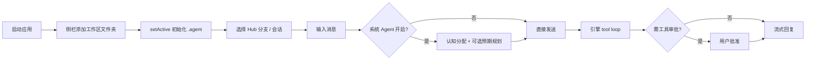

# ClawFlow 产品原型（以当前代码反推）

> **单一事实来源**：`src/App.tsx`、`src/components/Layout.tsx`、`src/pages/*`、`src/components/WorkspaceSidebar.tsx`。  
> 本文描述用户可见的信息架构与交互壳层，不绑定具体视觉稿。

## 1. 产品定位

ClawFlow 是一款 **以本地文件夹为工作区（Workspace）边界** 的 Electron 桌面 AI 协作应用。用户将项目目录挂载为工作区后，在同一壳层内完成：

- 多会话对话（流式、工具调用、审批）
- 工作区文件/ Git / Shell 等受控工具能力
- 待办定时触发、网页抓取、Hermes 技能与记忆检索
- 可选飞书入站桥接、本地 Gateway、系统子 Agent 辅助分类与规划

应用 **启动时不自动绑定工作区**；用户从侧栏添加或选择文件夹后才 `setActive`（见 `workspace-service.ts` 注释与 `WorkspaceSidebar`）。

## 2. 顶层导航

| 路由 | 页面 | 说明 |
|------|------|------|
| `/chat` | 聊天 + 工作区 Hub | 默认首页（`/` 重定向至此） |
| `/skills` | Hermes 技能浏览器 | 全页技能树/编辑（`SkillsPage`） |
| `/settings` | 设置中心 | 8 分区侧栏导航（见 §5） |
| `/dashboard` | — | 重定向到 `/settings`（历史入口） |

壳层全局：`Titlebar`（Windows 自定义标题栏）、`ToastHost`、`ErrorBoundary`、可选 `BottomShellFabs` / `StickyDesktopDock`。

## 3. 两种桌面壳层（Shell）

由 `useShellViewStore`（`clawflow.shellViewMode`）与 `ShellLayoutContext` 控制。

### 3.1 标准三栏壳（`standard`）

```
┌─────────────────────────────────────────────────────────────┐
│ Titlebar（菜单：聊天 / 技能 / 设置；窗口控制）                  │
├──────────┬──────────────────────────────┬───────────────────┤
│ Workspace│  主内容区（Outlet）           │ ChatRightTabs     │
│ Sidebar  │  - /chat → ChatPage          │ - 工作区文件树     │
│          │  - /skills → SkillsPage      │ - 内嵌浏览器       │
│ 工作区列表│  - /settings → SettingsPage  │ - 变更日志         │
│ Hub 分支 │                              │ - 抓取记录         │
│ 会话预览 │                              │                   │
└──────────┴──────────────────────────────┴───────────────────┘
         ↑ 可拖拽分栏宽度（localStorage 持久化）
```

- 窄屏（视口 &lt; 980px 且非便签模式）：侧栏与右栏折叠为移动布局（`cf-mobileBar`）。
- 证据：`src/components/Layout.tsx` L22–31、L161–210。

### 3.2 便签玻璃壳（`alternate`，仅 `/chat` 桌面宽屏）

- 整页替换为 `StickyNoteShell`：紧凑窗口、`cf-stickyGlassRoot` 样式、`window:setShellViewAppearance({ compact: true })`。
- 中心 Tab：**聊天 / 待办 / 知识库**（与侧栏 Hub 的 `todos`、`kb` 对应）；技能 Hub 在标准壳侧栏切换。
- **卫星窗**：便签可从主窗拖出为独立 `BrowserWindow`，通过 `sticky:openSatellite` / `mergeSatellite` 与 `sticky:detachedPaths` 事件同步路径列表。
- 底部：`StickyDesktopDock`（视图切换、进化测试等 FAB）。
- 证据：`Layout.tsx` L53–58、L156–159；`StickyNoteShell.tsx`。

## 4. 工作区侧栏（Workspace Hub）

每个已注册工作区在 `WorkspaceSidebar` 中展示，并支持 **Hub 四分支**（`workspaceHubStore`）：

| 分支 ID | 用户意图 | 主区展示 |
|---------|----------|----------|
| `sessions` | 默认：会话列表与聊天 | `ChatPage` 消息流 |
| `todos` | 定时/周期待办 | `TodoTriggersPanel` |
| `skills` | 工作区 Hermes 技能 | `SkillsHubPanel` |
| `kb` | 知识库（占位/检索 UI） | `KnowledgeBaseHubPanel` |

侧栏还提供：添加文件夹、新建工作区、Git pull/push、重置工作区缓存、工具能力勾选（`WorkspaceNewToolsModal`）、未读/待办/技能计数徽章。

> **历史迁移**：localStorage 中旧值 `subagents` 会映射为 `sessions`（工作区委派子 Agent UI 已移除）。

## 5. 聊天页原型（ChatPage）

### 5.1 主对话区

- 会话列表、切换、删除；`MessageList` + `ChatInput`（可拖拽调节输入区高度）。
- 流式回复：`StreamingMessage`、思考链 `streamingThinking`、活动状态 `streamingActivity`。
- **对话模式**（经认知分配或用户选择）：`ask` | `plan` | `multitask`（`chatStore`）。
- **发送前管线**（可选，由系统 Agent 设置控制）：
  1. **认知分配**（`cf-cognitive-allocation`）：M1–M5 分类 → 建议模式。
  2. **预期规划**（`cf-expectation-planning`）：复杂任务生成规划 Markdown，注入主对话上下文。
- `ChatApiKeyBar`：模型选择与鉴权提示。
- `ContextUsageRing`：上下文饱和度估算。
- `ToolApprovalBar`：敏感工具调用需用户批准。
- `PendingSendQueue`：排队发送。
- `ModeClassificationDebug` / `ExpectationPlanningPanel`：调试与规划展示（设置可开关）。

### 5.2 聊天右栏（ChatRightTabs）

| Tab | 能力 |
|-----|------|
| workspace | 工作区目录浏览、预览 |
| changes | 工作区变更日志 |
| scrape | 抓取任务列表与全文工件 |

### 5.3 全局浮动

- `TodoTriggersStickyFloat`：待办快捷入口。
- 待办到点：`todo-trigger:fired` → 可自动 `submitToModel` 注入聊天（`Layout` 订阅）。

## 6. 技能页（SkillsPage）

- 独立于 Hub 的全页 **Hermes 技能浏览器**（`HermesSkillsBrowser`）：列出 `.agent/.skills/` 下技能目录、启用状态、文件读写（经 IPC `workspaceSkills:*`）。

## 7. 设置页原型（SettingsPage）

左侧 8 个固定分区（`SETTINGS_SECTION_IDS`）：

| Section | 原型内容 |
|---------|----------|
| **account** | 当前工作区路径、工作区工具 manifest 勾选、关于/版本 |
| **agents** | 系统子 Agent 三槽位、模型覆盖、名册重载（`SystemAgentsSettingsPanel`） |
| **system** | 主题/语言/字号/日志、引擎 tool loop、出站合并窗口、关闭按钮行为、应用缓存根 |
| **memory** | Hermes 记忆 FTS 搜索/重建、技能相关开关（`MemorySettingsPanel`） |
| **models** | Provider 鉴权档、连接测试、聊天模型目录 |
| **integrations** | Gateway 启停/日志；飞书多 Bot、桥接工作区会话、测试消息 |
| **data** | 工作区数据 vs 全局数据说明 |
| **help** | 关于、许可、指南链接 |

## 8. 关键用户旅程



1. **首次使用**：添加工作区 → 自动 `ensureWorkspaceToolBundle`、角色模板、Hermes skill-creator、主记忆模板。
2. **Plan/Multitask 改代码**：模型调用 `workspace_*` 工具 → manifest 过滤 schema → 执行二次校验 → 变更写入工作区 → 右栏「变更」可见。
3. **定时待办**：创建 trigger → 主进程 cron 调度 → 到点 Toast/注入模型。
4. **飞书消息**：配置 Bot → WS 入站 → 桥接到指定工作区会话（`feishu-event-server`）。
5. **便签模式**：切换 `alternate` → 紧凑窗 + 玻璃 UI → 可选拖出卫星窗。

## 9. 与旧文档的差异（原型层）

| 旧设想 | 当前代码 |
|--------|----------|
| 工作区 Hub「子 Agent」分支 | 已移除；系统 Agent 在设置页 `agents` |
| 工作区 `.subagent/` 委派 UI | 打开工作区时清理遗留目录 |
| OpenClaw 技能市场页 | 已移除；改为 Hermes `.agent/.skills/` + `/skills` 页 |
| 独立 Dashboard 路由 | 合并进 `/settings` |

## 10. 未挂载 / 占位 UI

- `StatesPage` 存在但未在 `App.tsx` 注册。
- 知识库 Hub / `workspace_knowledge_query` 工具：UI 与 Retriever 仍为占位或 stub。
- 部分 `messaging` 渠道在 `PLACEHOLDER_MESSAGING_CHANNELS` 中仅为占位常量。

---

**维护**：UI 变更时同步更新 `src/locales/zh.json` / `en.json` 与本文 §4–§7 表格。
